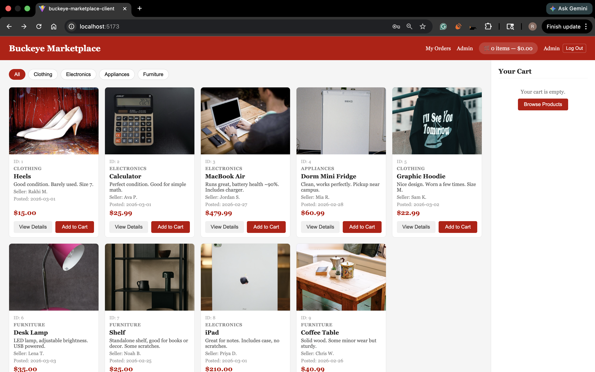
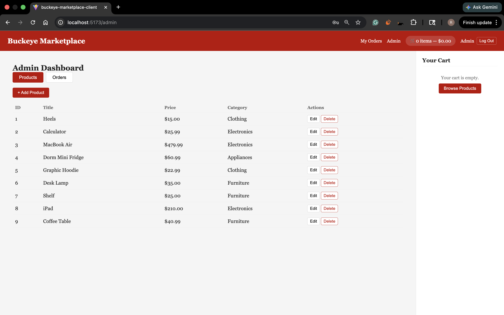
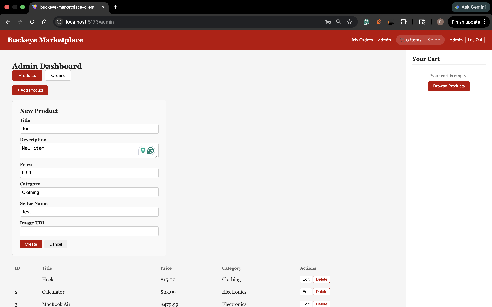
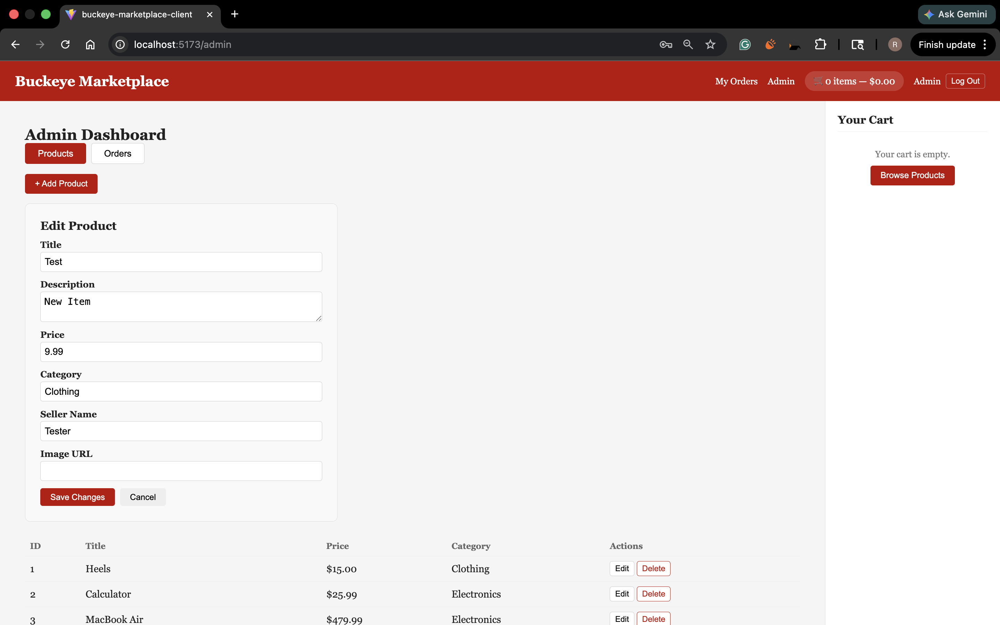
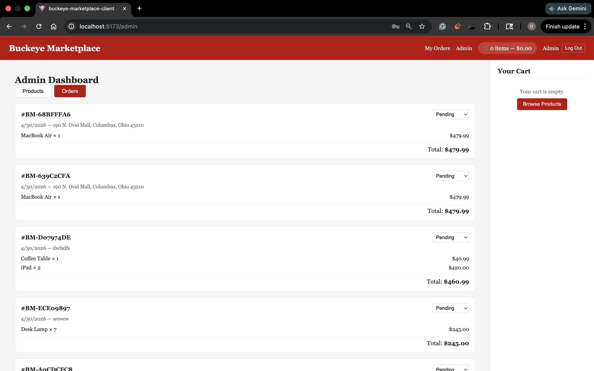
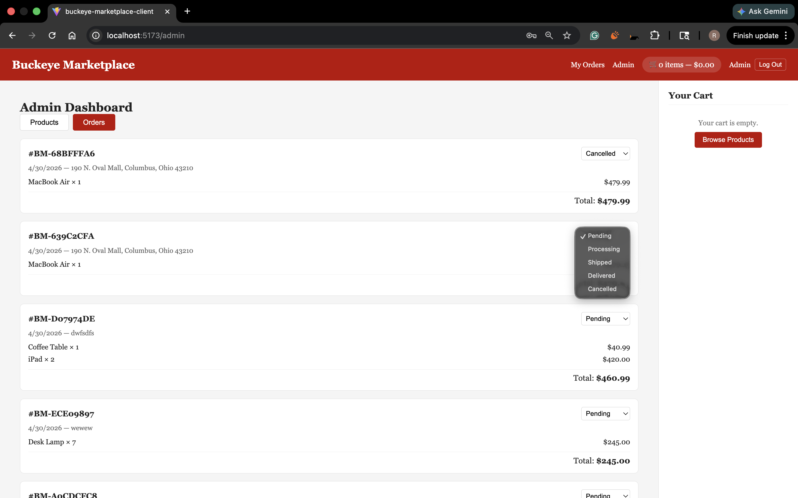

# Admin Guide

For admins of Buckeye Marketplace. Admins can manage the catalog and update order statuses.

App URL: **https://polite-beach-0f0c3400f.7.azurestaticapps.net**
Default admin: `admin@buckeyemarketplace.com` / `Admin123!`

---

## 1. Sign In

Sign in with the admin email and password. The system reads your role and shows the **Admin Dashboard** link in the header. Regular accounts don't see it.

If a regular user tries to hit an admin route, the API returns 403 and the UI sends them home.

---

## 2. Manage Products

Open the dashboard and pick the **Products** tab. You'll see every product with current price, category, and seller.

### Create
Click **New Product**. Fill in title, description, price, category, seller, and image URL. Submit and it goes live in the catalog.

### Edit
Click the edit icon on any row. Change anything. Save. Changes show up in the public listing within seconds.

### Delete
Click the delete icon. Confirm. Product gone from the catalog.

> Deleted products still show up correctly in past orders. Order line items keep a copy of the price and product name from when the buyer placed the order.

---

## 3. Manage Orders

Switch to the **Orders** tab. Unlike `/orders/mine` for buyers, this view shows every order from every user.

You see buyer email, total, item count, shipping address, current status, and date. Click an order to see the line items.

### Update status
Each order has a dropdown for transitions: **Pending** to **Shipped** to **Delivered**. **Cancelled** is available from any state. Pick a new status and it saves immediately. The buyer sees the change in their own order history.

---

## 4. Security Notes

- Admin checks happen server side via the role claim on the JWT. Frontend logic alone doesn't grant access.
- Connection strings and JWT keys live in Azure App Settings, not in source.
- HTTPS enforced on every endpoint.

---

## 5. Quick Reference

| Task | Where |
|---|---|
| Sign in as admin | Header, Log In, admin credentials |
| Create product | Dashboard, Products, New Product |
| Edit product | Dashboard, Products, edit icon |
| Delete product | Dashboard, Products, delete icon |
| View all orders | Dashboard, Orders |
| Update order status | Dashboard, Orders, status dropdown |