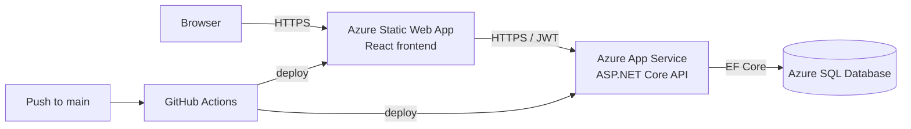
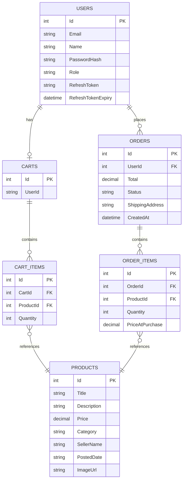

# osu-buckeye-marketplace

A marketplace app for OSU students to buy and sell stuff to each other. Started as a class assignment about user personas. Six milestones later it's a deployed full stack app with auth, admin tools, and CI/CD.

**Live links**
- Frontend: https://polite-beach-0f0c3400f.7.azurestaticapps.net
- Backend: https://buckeye-api-shreyas.azurewebsites.net
- Swagger: https://buckeye-api-shreyas.azurewebsites.net/

**Demo accounts**
- Admin: `admin@buckeyemarketplace.com` / `Admin123!`
- Or just register a new buyer from the UI

---

## What it does

Buyers can:
- Browse products and filter by category
- Add stuff to a cart that saves on the server (works across reloads and devices)
- Register, log in, place orders with a shipping address
- See past orders and their statuses

Admins can:
- Use the admin dashboard (gated by a role on the JWT)
- Add, edit, delete products
- See every order in the system and update statuses

It's also actually deployed properly:
- HTTPS everywhere
- Secrets in Azure App Settings, never in source
- Tests run on every push
- CI auto deploys to Azure on green

---

## Tech stack

| Layer | What |
|---|---|
| Frontend | React 18 + TypeScript 5 with Vite 8 |
| Styling | plain CSS with a bit of Tailwind |
| Frontend tests | Vitest + React Testing Library |
| E2E | Playwright |
| Backend | ASP.NET Core 8 Web API |
| ORM | EF Core 8.0.8 |
| Auth | JWT bearer (HS256) plus refresh tokens |
| Backend tests | xUnit + WebApplicationFactory |
| Local DB | SQLite |
| Prod DB | Azure SQL (Basic) |
| Frontend host | Azure Static Web Apps |
| Backend host | Azure App Service Linux (B1) |
| CI/CD | GitHub Actions |

---

## Run it locally

You need .NET 8 SDK and Node 20+. Two terminals.

### Backend
```bash
cd backend/BuckeyeMarketplace.Api
dotnet user-secrets set "Jwt:Key" "AnyLocalDevKeyAtLeast32CharactersLong!"
dotnet run
```
API is on `http://localhost:5062`. Swagger is at the root in dev.

### Frontend
```bash
cd frontend/buckeye-marketplace-client
npm install
npm run dev
```
Opens on `http://localhost:5173`. It reads `.env.development` which points the API at localhost.

### Tests
```bash
cd backend/BuckeyeMarketplace.Api.Tests && dotnet test
cd frontend/buckeye-marketplace-client && npm test
# E2E (frontend has to be running first)
npx playwright test
```

---

## Environment variables

| Name | Where it lives | What it's for |
|---|---|---|
| `Jwt:Key` | local user secrets / `Jwt__Key` in Azure | HS256 signing key. Has to be 32+ chars |
| `ConnectionStrings:DefaultConnection` | App Service connection strings | Azure SQL connection. Falls back to SQLite locally |
| `AllowedOrigins:0` | `AllowedOrigins__0` in Azure | CORS allowlist for the frontend |
| `ASPNETCORE_ENVIRONMENT` | App Settings | `Production` in prod. Switches between SQLite and SQL Server |
| `VITE_API_BASE` | `frontend/.env.production` and `.env.development` | Where the frontend points its API calls |

Vite picks the right env file automatically based on whether you're running `dev` or `build`.

---

## How deployment works

Three Azure resources in the `rg-buckeye-marketplace` group:

| Resource | Name | Tier |
|---|---|---|
| Static Web App | `buckeye-frontend-shreyas` | Free |
| App Service | `buckeye-api-shreyas` | B1 |
| SQL DB | `BuckeyeMarketplaceDb` on `buckeye-sql-sm2026` | Basic |

### Auto deploy
Push to `main`. GitHub Actions builds, tests, then deploys both sides. Workflows are in `.github/workflows/`.

### Manual backend deploy (if needed)
```bash
cd backend/BuckeyeMarketplace.Api
dotnet publish -c Release -o ./publish
cd publish && zip -r ../publish.zip . && cd ..
az webapp deploy \
  --resource-group rg-buckeye-marketplace \
  --name buckeye-api-shreyas \
  --src-path publish.zip \
  --type zip
```

### Manual frontend deploy
```bash
cd frontend/buckeye-marketplace-client
npm run build
swa deploy ./dist --deployment-token <token> --env production
```

---

## Architecture



The frontend is a static SPA. It talks to the backend over HTTPS using a JWT in localStorage. The backend is stateless. State lives in Azure SQL. Every push to main runs CI which builds, tests, then deploys.

---

## Database schema



A user has one cart but many orders. Cart items and order items are separate tables on purpose. That way past orders keep the price the buyer actually paid even if the seller edits or deletes the product later. The `Role` column on Users is encoded into the JWT and checked server side.

---

## API docs

Live Swagger is at the API root in prod: **https://buckeye-api-shreyas.azurewebsites.net/**

| Method | Path | Auth | What |
|---|---|---|---|
| POST | `/api/auth/register` | none | Create account. Returns JWT + refresh |
| POST | `/api/auth/login` | none | Sign in |
| POST | `/api/auth/refresh` | none | Trade refresh for fresh JWT |
| GET | `/api/products` | none | List all |
| GET | `/api/products/{id}` | none | Single product |
| POST | `/api/products` | admin | Create |
| PUT | `/api/products/{id}` | admin | Update |
| DELETE | `/api/products/{id}` | admin | Delete |
| GET | `/api/cart` | user | Current cart |
| POST | `/api/cart` | user | Add item |
| PUT | `/api/cart/{cartItemId}` | user | Update quantity |
| DELETE | `/api/cart/{cartItemId}` | user | Remove item |
| DELETE | `/api/cart/clear` | user | Empty cart |
| POST | `/api/orders` | user | Place order |
| GET | `/api/orders/mine` | user | My orders |
| GET | `/api/orders` | admin | All orders |
| PUT | `/api/orders/{orderId}/status` | admin | Update status |

---

## AI tool usage

I used GitHub Copilot in the editor and Claude as a chat partner. Started with ChatGPT in M3 but switched to Claude after that and stuck with it.

Across milestones:
- **M1, M2:** Claude for brainstorming personas and the buyer journey
- **M3:** ChatGPT for catalog scaffolding. Worked but kept losing context
- **M4:** Claude for the cart redesign, React Router migration, useState to useReducer rewrite, EF migration to SQLite
- **M5:** Claude scaffolded the JWT pipeline, refresh tokens, admin role enforcement, and orders end to end
- **M6:** Most hands on session. Debugged the SQLite vs SQL Server migration issue, the JWT key length crash, the seed data IDENTITY conflict, the App Service quota, and the CI workflow YAML

What I changed from AI suggestions:
- Kept components in separate files instead of one big file
- Adjusted styling that didn't match the look I wanted
- Picked seed data and image URLs myself
- Used `EnsureCreated()` for prod schema instead of generating SQL Server migrations (fine for school, not real prod)

What I did myself:
- All manual end to end testing in the deployed app
- Cross browser smoke testing (Safari, Chrome, Firefox)
- Reviewed every CI change before pushing it

Full reflection in `AI_REFLECTION.md`.

---

## Docs

| File | What |
|---|---|
| `Testplan.md` | Test plan and bug log |
| `USER_GUIDE.md` | How to use the app as a buyer |
| `ADMIN_GUIDE.md` | How to use admin features |
| `AI_REFLECTION.md` | Reflection on AI tools |

Screenshots are in `Screenshots/`.

---

## Repo layout

```
osu-buckeye-marketplace/
├── backend/
│   ├── BuckeyeMarketplace.Api/
│   └── BuckeyeMarketplace.Api.Tests/
├── frontend/
│   └── buckeye-marketplace-client/
├── .github/workflows/
│   ├── backend-ci-cd.yml
│   └── frontend-ci-cd.yml
├── Screenshots/
└── osu-buckeye-marketplace.sln
```

---

## License

MIT.