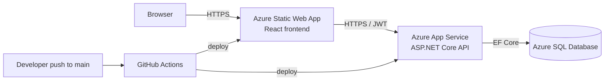
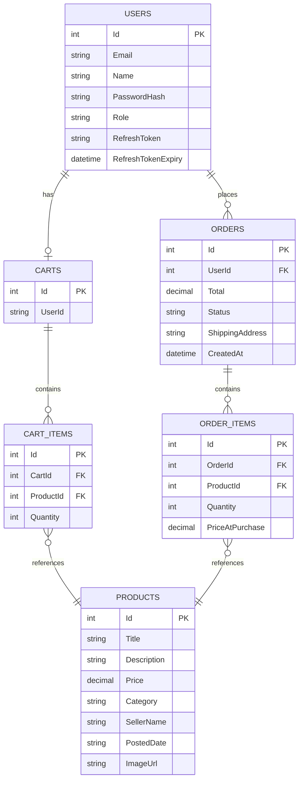

# osu-buckeye-marketplace

A full-stack e-commerce platform built for Ohio State University students to buy and sell items with each other. Started as a coursework project focused on user personas and journey mapping, grew into a deployed production application over six milestones.

**Live URLs**
- Frontend: https://polite-beach-0f0c3400f.7.azurestaticapps.net
- Backend API: https://buckeye-api-shreyas.azurewebsites.net
- API documentation (Swagger): https://buckeye-api-shreyas.azurewebsites.net/

**Demo accounts**
- Admin: `admin@buckeyemarketplace.com` / `Admin123!`
- Or register a fresh buyer account from the UI

---

## 1. Features

**Buyer-side**
- Browse a catalog of student-listed items with category filters
- Product detail pages with full description, price, seller, posting date
- Shopping cart with add, update quantity, remove, and clear (server-persisted, survives refresh)
- Account registration and login with JWT-based authentication
- Place orders with shipping address; view order history and per-order status
- Refresh-token flow so sessions survive token expiry without forced logouts

**Admin-side**
- Admin dashboard gated by role claim on the JWT
- Create, edit, and delete products
- View every order across all users; update order status

**Production qualities**
- HTTPS on both frontend and backend
- Secrets stored in Azure App Settings (no credentials in source)
- Automated unit, component, and end-to-end tests run on every push
- CI/CD pipeline auto-deploys to Azure on push to `main`

---

## 2. Technology Stack

| Layer | Technology | Version |
|---|---|---|
| Frontend framework | React + TypeScript | React 18, TS 5 |
| Frontend tooling | Vite | 8 |
| Styling | Tailwind CSS | 3 |
| Frontend testing | Vitest + React Testing Library | latest |
| End-to-end testing | Playwright | latest |
| Backend framework | ASP.NET Core Web API | .NET 8 |
| ORM | Entity Framework Core | 8.0.8 |
| Authentication | JWT bearer (HS256) + refresh tokens | — |
| Backend testing | xUnit + WebApplicationFactory | latest |
| Local database | SQLite | — |
| Production database | Azure SQL Database (Basic tier) | — |
| Hosting (frontend) | Azure Static Web Apps | — |
| Hosting (backend) | Azure App Service Linux (B1) | — |
| CI/CD | GitHub Actions | — |

---

## 3. Local Development Setup

You need two terminals running at the same time. Prerequisites: .NET 8 SDK, Node.js 20+.

### Backend
```bash
cd backend/BuckeyeMarketplace.Api
dotnet user-secrets set "Jwt:Key" "AnyLocalDevKeyAtLeast32CharactersLong!"
dotnet run
```
The API starts at `http://localhost:5062`. Swagger is at the root in development.

### Frontend
```bash
cd frontend/buckeye-marketplace-client
npm install
npm run dev
```
Opens at `http://localhost:5173` and reads from `.env.development`, which points the API base at `localhost:5062`.

### Running tests locally
```bash
# Backend unit + integration tests
cd backend/BuckeyeMarketplace.Api.Tests
dotnet test

# Frontend unit + component tests
cd frontend/buckeye-marketplace-client
npm test

# End-to-end (frontend must be running)
npx playwright test
```

---

## 4. Environment Variables

| Name | Where set | Purpose |
|---|---|---|
| `Jwt:Key` | `dotnet user-secrets` (local) / Azure App Settings as `Jwt__Key` (prod) | HS256 signing key. Must be ≥ 32 characters / 256 bits. |
| `ConnectionStrings:DefaultConnection` | Azure App Service connection string named `DefaultConnection` | Azure SQL connection. Local dev falls back to SQLite (`marketplace.db`). |
| `AllowedOrigins:0`, `AllowedOrigins:1`, ... | Azure App Settings as `AllowedOrigins__0` etc. | CORS allowlist for the deployed frontend. |
| `ASPNETCORE_ENVIRONMENT` | Azure App Settings | Set to `Production` in prod. Drives the SQLite/SQL Server switch in `Program.cs`. |
| `VITE_API_BASE` | `frontend/.env.development` and `.env.production` | API base URL the frontend talks to. |

The frontend `.env.production` points at the live backend URL above; `.env.development` points at `localhost:5062`. Vite picks the right one automatically based on whether you're running `dev` or `build`.

---

## 5. Deployment

The application is deployed to Azure across three resources, all in the `rg-buckeye-marketplace` resource group:

| Resource | Name | Tier |
|---|---|---|
| Frontend | `buckeye-frontend-shreyas` (Static Web App) | Free |
| Backend | `buckeye-api-shreyas` (App Service Linux) | Basic B1 |
| Database | `BuckeyeMarketplaceDb` on `buckeye-sql-sm2026` | Basic |

### Automated deployment (preferred)
Pushing to `main` triggers GitHub Actions which build, test, and deploy each side automatically. See `.github/workflows/`.

### Manual backend deployment
```bash
cd backend/BuckeyeMarketplace.Api
dotnet publish -c Release -o ./publish
cd publish && zip -r ../publish.zip . && cd ..
az webapp deploy \
  --resource-group rg-buckeye-marketplace \
  --name buckeye-api-shreyas \
  --src-path publish.zip \
  --type zip
```

### Manual frontend deployment
```bash
cd frontend/buckeye-marketplace-client
npm run build
swa deploy ./dist \
  --deployment-token <token from Azure portal> \
  --env production
```

---

## 6. Architecture



The frontend is a Single Page Application served as static files. It calls the backend over HTTPS using a JWT bearer token stored in `localStorage`. The backend is a stateless REST API; persistent state lives in Azure SQL. CI/CD reacts to pushes on `main`, runs tests, and deploys both sides to their respective Azure services.

---

## 7. Database Schema



A user has at most one cart at a time but many orders. Cart and order items are separate tables so historical orders preserve the price at purchase time even if the underlying product is later edited or deleted. The `Role` column on `Users` (`Buyer` or `Admin`) is encoded into the JWT and checked server-side on protected endpoints.

---

## 8. API Documentation

Interactive Swagger / OpenAPI docs are served at the API root in production:

**https://buckeye-api-shreyas.azurewebsites.net/**

Endpoints summary:

| Method | Path | Auth | Purpose |
|---|---|---|---|
| POST | `/api/auth/register` | none | Create account, returns JWT + refresh token |
| POST | `/api/auth/login` | none | Sign in, returns JWT + refresh token |
| POST | `/api/auth/refresh` | none | Exchange refresh token for fresh JWT |
| GET | `/api/products` | none | List all products |
| GET | `/api/products/{id}` | none | Single product detail |
| POST | `/api/products` | admin | Create a product |
| PUT | `/api/products/{id}` | admin | Update a product |
| DELETE | `/api/products/{id}` | admin | Delete a product |
| GET | `/api/cart` | user | Current user's cart |
| POST | `/api/cart` | user | Add item to cart |
| PUT | `/api/cart/{cartItemId}` | user | Update item quantity |
| DELETE | `/api/cart/{cartItemId}` | user | Remove item |
| DELETE | `/api/cart/clear` | user | Empty cart |
| POST | `/api/orders` | user | Place order from current cart |
| GET | `/api/orders/mine` | user | Current user's orders |
| GET | `/api/orders` | admin | All orders |
| PUT | `/api/orders/{orderId}/status` | admin | Update order status |

---

## 9. AI Tool Usage Across the Project

Across all six milestones I used a mix of GitHub Copilot in the editor and Claude as a longer-form coding partner. Copilot handled in-line completions and small refactors. Claude was the primary tool for design choices, debugging, and longer changes.

**By milestone:**

- **M1 (planning)** — used both tools to brainstorm user personas, then refined manually.
- **M3 (product catalog)** — used ChatGPT, but found it less reliable on the fullstack TypeScript + .NET shape. Switched to Claude after this milestone.
- **M4 (cart)** — Claude did the React Router migration, useState → useReducer rewrite, and the cart sidebar redesign. I kept the project structure split across files even when Claude proposed consolidating.
- **M5 (auth + orders)** — Claude scaffolded the JWT pipeline, refresh-token flow, admin role enforcement, and the orders feature end-to-end. I tested manually and pushed back on details (e.g. wanting cookies vs. localStorage for tokens — kept localStorage for simplicity).
- **M6 (deployment)** — Claude walked me through the Azure CLI deployment, debugged the EF Core SQLite-vs-SQL-Server migration issue, the JWT key length crash, the seed-data IDENTITY conflict, the App Service quota issue, and the CI workflow YAML. See `docs/AI_REFLECTION.md` for the deeper reflection.

**What I changed from AI suggestions:**
- Kept components in separate files instead of one large file
- Adjusted styling that didn't match the visual direction
- Picked seed data and image URLs myself
- Used `EnsureCreated()` for prod schema instead of generating SQL Server-specific migrations (acceptable for school project; flagged in test plan as a real-world limitation)

**Where I used my own judgment:**
- Manual end-to-end testing of every cart, checkout, and order flow against the deployed app
- Cross-browser smoke testing in Safari, Chrome, and Firefox
- Reviewed every CI workflow change before pushing instead of trusting it blindly

A more detailed reflection lives in `docs/AI_REFLECTION.md`.

---

## 10. Documentation

| Document | Location |
|---|---|
| Test plan and QA report | `docs/TEST_PLAN.md` |
| User guide (with screenshots) | `docs/USER_GUIDE.md` |
| Admin guide (with screenshots) | `docs/ADMIN_GUIDE.md` |
| AI tool reflection | `docs/AI_REFLECTION.md` |
| Architecture (this README, section 6) | above |
| DB schema (this README, section 7) | above |

Screenshots live under `Screenshots/`.

---

## 11. Repository Layout

```
osu-buckeye-marketplace/
├── backend/
│   ├── BuckeyeMarketplace.Api/           # ASP.NET Core Web API
│   └── BuckeyeMarketplace.Api.Tests/     # xUnit + integration tests
├── frontend/
│   └── buckeye-marketplace-client/       # React + TypeScript SPA
├── .github/workflows/
│   ├── backend-ci-cd.yml                 # Build, test, deploy backend
│   └── frontend-ci-cd.yml                # Build, test, deploy frontend
├── docs/                                 # All milestone deliverables
├── Screenshots/                          # UI screenshots
└── osu-buckeye-marketplace.sln           # .NET solution file
```

---

## 12. License

MIT — see `LICENSE`.