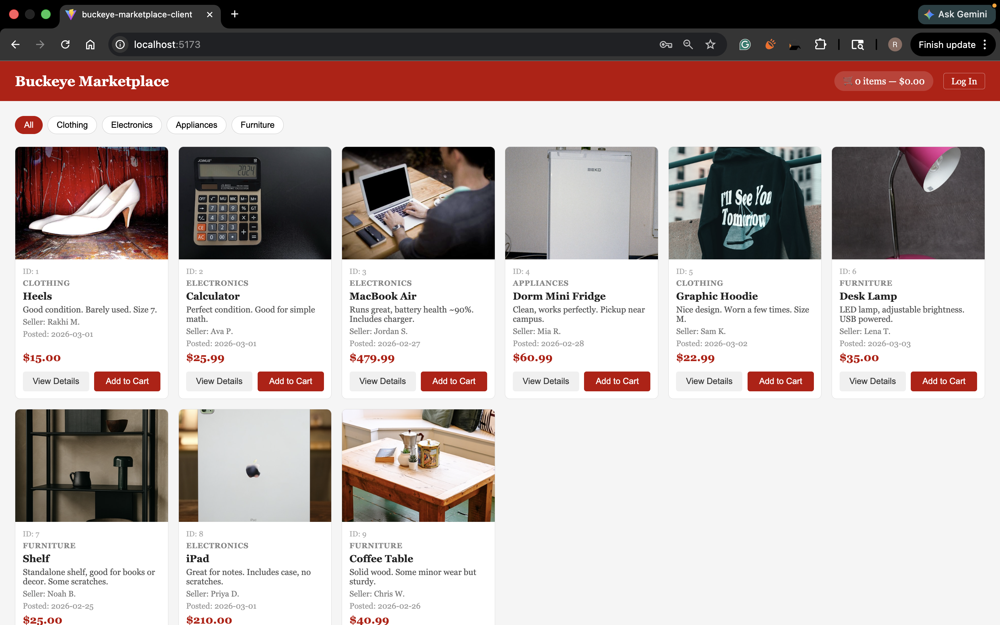
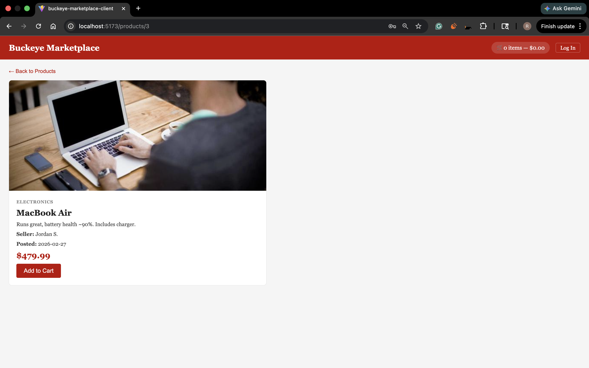
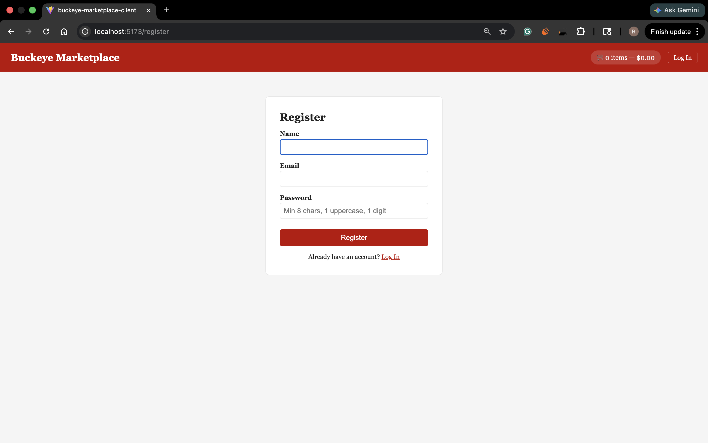
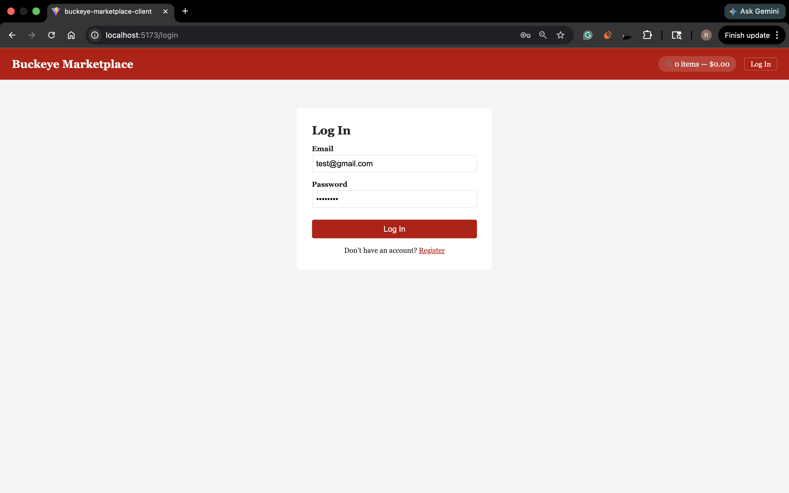
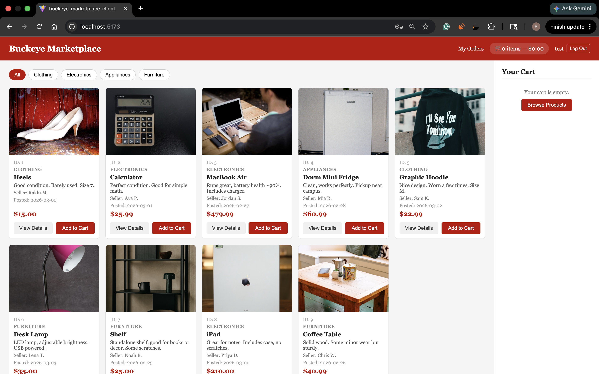
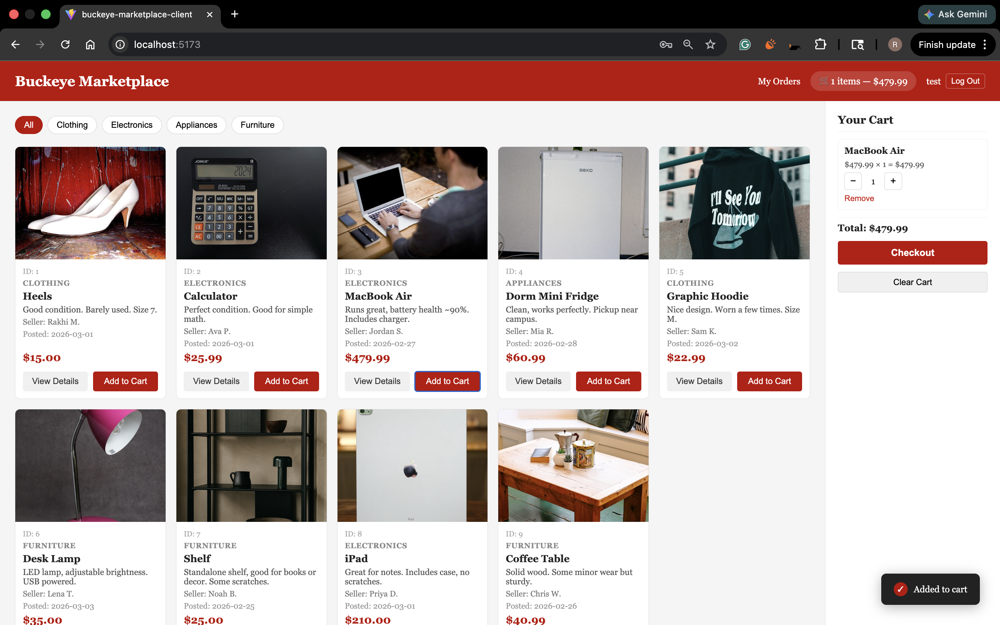
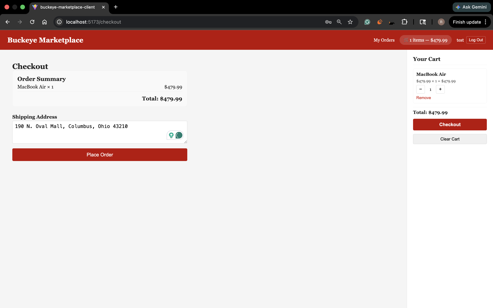
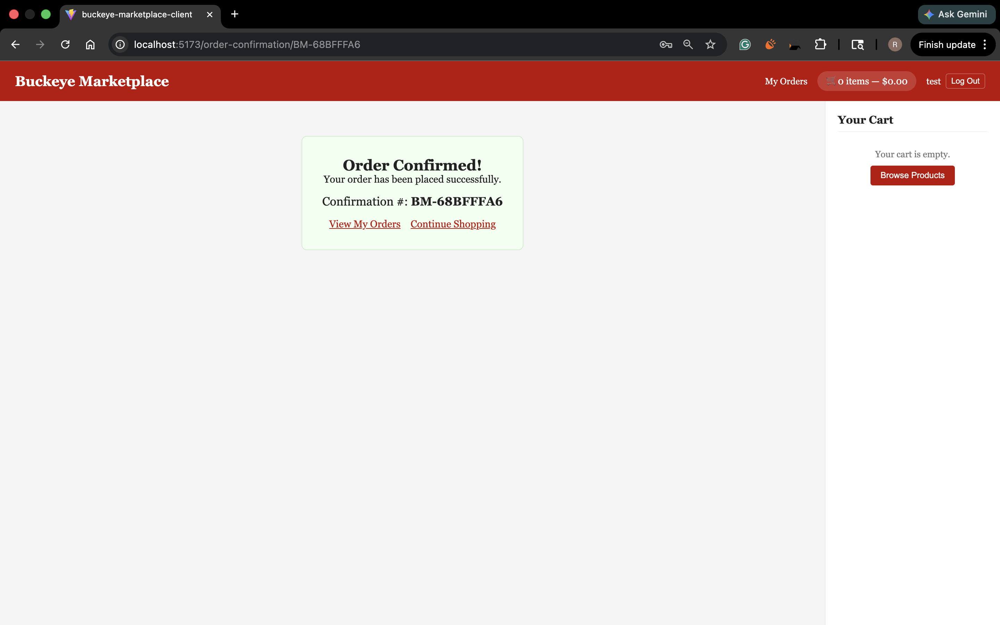
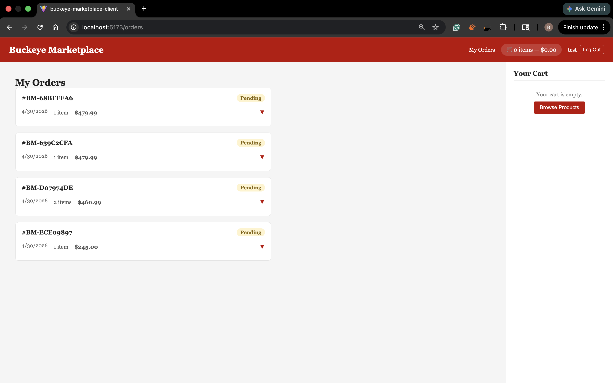
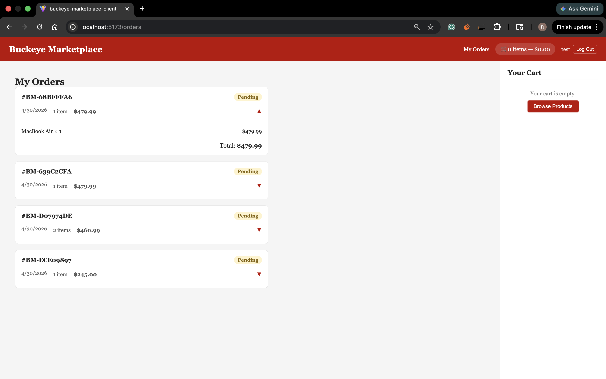

# User Guide

How to use Buckeye Marketplace as a buyer.

App URL: **https://polite-beach-0f0c3400f.7.azurestaticapps.net**

---

## 1. Browse Products

The homepage shows every product currently listed. Each card has the image, title, price, category, seller name, and date posted. You don't need to be signed in to browse.

Click a card to see the full details and a bigger image.

Use the category buttons at the top to narrow things down.

---

## 2. Make an Account

Click **Register** in the top right. Enter your name, email, and password. Submit and you're in. There's no email verification.

Already have an account? Click **Log In** instead.

You'll know you're signed in because the top right of the page shows your name and a Logout button. The session sticks across reloads. The app refreshes your token automatically when needed.

---

## 3. Add to Cart

Once you're signed in, click **Add to Cart** on any product card or detail page. The cart counter at the top goes up.

Click the cart icon in the header to open the sidebar. From there you can:
- Change quantity
- Remove individual items
- Clear the whole cart
- See the running total

Cart is saved on the server. Log in from another device or come back tomorrow and it's still there.

---

## 4. Place an Order

When you're done shopping click **Checkout** at the bottom of the cart. Enter a shipping address.

The order is placed, your cart is cleared, and you get a confirmation with the order number.

---

## 5. View Past Orders

Click **My Orders** in the header. Every order you've placed shows up with date, total, status, and a count of items.

Click any order to expand it. You'll see each item with the price you paid, even if the seller later changed it.

---

## 6. Log Out

Click your name in the top right and pick **Logout**. Your tokens are cleared. Cart stays saved on the server.

---

## Tips

- Works on phones. Cart sidebar moves below the products on small screens.
- If you see "Failed to fetch", reload. The backend may be cold starting.
- For demo purposes you can sign in with admin (`admin@buckeyemarketplace.com` / `Admin123!`) to see admin features. See the admin guide for details.